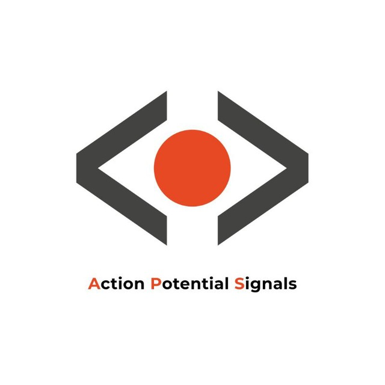

  <h1 style="color:orange">ZANA NOURI</h1>
  

  <h3>Full-stack developer with expertise in front-end and back-end</h3>

  <h1>My Experiences</h1>

<h1>My Social Network</h1>
<a href="https://www.instagram.com/zana_hhh" target="_blank" rel="nofollow">
    
  
</a>
